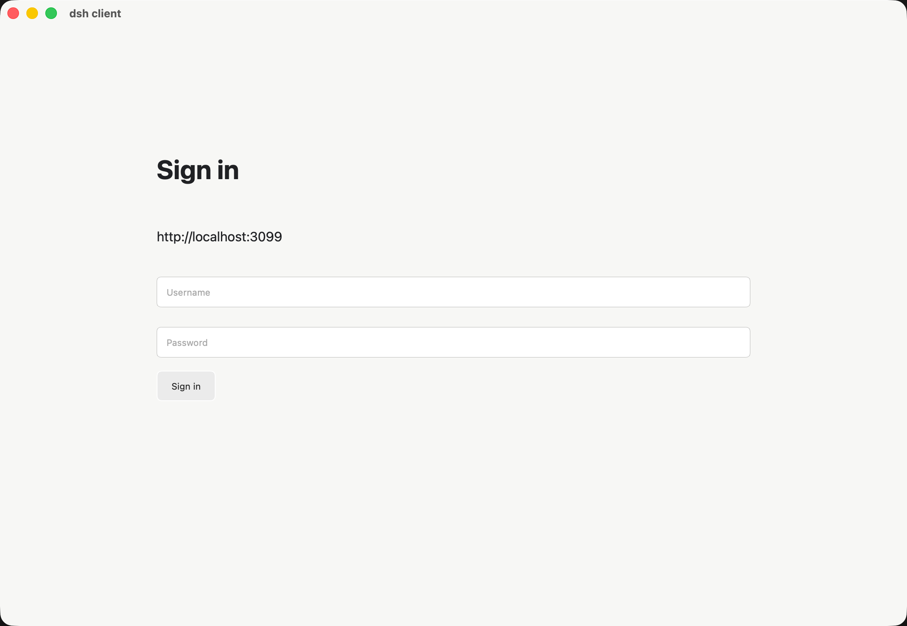

# dsh-client-app

为 [DeepSeek Harness](https://github.com/deepseek-ai/deepseek-harness) 提供登录保护插件和 Tauri 桌面客户端。

- `dsh-auth/`：保护 dsh Web 页面、HTTP API 和 WebSocket。
- `dsh-cloudflare-tunnel/`：可选的 Cloudflare Tunnel 插件。
- `tauri-client/`：Tauri 2 + React 桌面客户端。

## 给 Coding Agent 的安装步骤

在已安装 Node.js 20+、pnpm 10+ 和 `dsh` CLI 的机器上执行。以下脚本可直接交给 Coding Agent 执行：

```bash
set -euo pipefail
REPO_DIR="${REPO_DIR:-$PWD/dsh-client-app}"
if [ ! -d "$REPO_DIR/.git" ]; then
  git clone https://github.com/chengyingshe/dsh-client-app.git "$REPO_DIR"
fi
cd "$REPO_DIR/dsh-auth"
pnpm install --frozen-lockfile
pnpm typecheck
pnpm test
dsh plugin --profile web add "link:$PWD"
dsh plugin --profile web list
```

启动 dsh Web（本地测试凭据）：

```bash
DSH_AUTH_USERNAME=tester DSH_AUTH_PASSWORD=test-pass \
DSH_AUTH_TOKEN_SECRET="$(openssl rand -base64 32)" \
dsh web --no-open --port 3099
```

访问 <http://127.0.0.1:3099>，使用 `tester` / `test-pass` 登录。生产环境必须替换凭据并使用 HTTPS。

如果使用本地 Harness 源码，请先执行 `corepack pnpm run build:lib:host`，再用 `corepack pnpm dsh web` 启动。三个 `DSH_AUTH_*` 变量均为必填项。

## 启动桌面客户端

需要 Rust stable 和 Tauri 系统依赖：

```bash
cd "$REPO_DIR/tauri-client"
pnpm install --frozen-lockfile
pnpm typecheck
pnpm test
pnpm build
pnpm tauri dev
```

客户端中填写 dsh Web 地址，例如 `http://127.0.0.1:3099`。

## Cloudflare Tunnel（可选）

```bash
cd "$REPO_DIR/dsh-cloudflare-tunnel"
pnpm install --frozen-lockfile
pnpm typecheck
pnpm test
```

使用 `cloudflared tunnel` 前，请将域名路由到 dsh Web 端口。不要提交密码、Token、Cookie 或 Cloudflare credentials。

网络不稳定时建议使用 `cloudflared tunnel --protocol http2`。

## 验证与 CI

```bash
cd "$REPO_DIR/dsh-auth" && pnpm typecheck && pnpm test
cd "$REPO_DIR/dsh-cloudflare-tunnel" && pnpm typecheck && pnpm test
cd "$REPO_DIR/tauri-client" && pnpm typecheck && pnpm test && pnpm build
```

GitHub Actions 会在 `main` push 和 Pull Request 时运行检查；发布 GitHub Release 时构建 macOS、Windows 和 Linux 安装包。

## 常见问题

- `530/1033`：Cloudflare Tunnel 未运行或已退出；检查 `cloudflared` 进程并使用 HTTP/2。
- `app_hide.toml not found`：项目重命名后遗留 Tauri `target` 缓存；停止 Tauri 后移走 `tauri-client/src-tauri/target` 再重试。
- 修改服务器：在 Tauri 顶部工具栏点击 `Change server`。
- 退出登录：点击 `Sign out`，客户端会调用 `/auth/logout` 并清理 WebView Cookie。

## 配置项

| 变量 | 必填 | 说明 |
| --- | --- | --- |
| `DSH_AUTH_USERNAME` | 是 | 登录用户名 |
| `DSH_AUTH_PASSWORD` | 是 | 登录密码 |
| `DSH_AUTH_TOKEN_SECRET` | 是 | Token 签名密钥 |
| `DSH_AUTH_ACCESS_TOKEN_TTL` | 否 | Access Token 有效期 |
| `DSH_AUTH_REFRESH_TOKEN_TTL` | 否 | Refresh Token 有效期 |
| `DSH_PUBLIC_URL` | 否 | 对外访问地址 |

## 预览




## 许可证

MIT，详见 [LICENSE](./LICENSE)。
