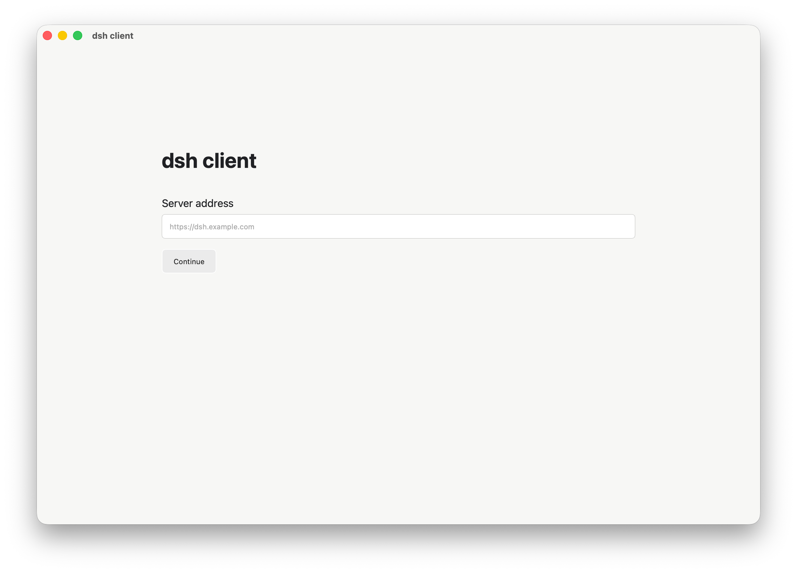

# dsh 认证插件与桌面客户端

为 [DeepSeek Harness](../deepseek-harness) 提供登录保护的 `dsh-plugin`，以及基于 Tauri 2 + React 的桌面客户端。插件负责保护 `dsh web` 的页面、HTTP API 和 WebSocket；客户端打开同一个 Web 登录页，登录一次后直接使用原始 dsh Web 界面。

## 应用预览

启动客户端后，先输入 dsh Web 服务器地址。点击 `Continue` 后，客户端会打开统一的 dsh Web 登录页，登录成功后直接进入原始 Web 应用。



## 特性

- 用户名和密码认证，密码只通过环境变量配置。
- 登录后使用 HttpOnly Cookie 和短期 Token 保护页面、API、WebSocket。
- 支持局域网地址，也支持通过 Cloudflare Tunnel 暴露公网地址。
- Tauri 客户端只保留服务器地址配置，认证流程与 Web 端统一，避免重复登录。
- 插件卸载或停用后，dsh 恢复原始行为。

## 项目结构

```text
client-app/
├── dsh-plugin/       # dsh Host 插件
└── tauri-client/     # Tauri 2 + React 客户端
```

## 快速开始

### 环境要求

- macOS、Windows 或 Linux
- Node.js 20 或更高版本
- pnpm 9 或更高版本
- Rust stable（运行 Tauri 客户端时需要）
- 已构建的 DeepSeek Harness 源码仓库

### 启动 dsh Web

在本项目的上级目录中执行：

```bash
cd ../deepseek-harness

DSH_AUTH_USERNAME=tester \
DSH_AUTH_PASSWORD=test-pass \
DSH_AUTH_TOKEN_SECRET="$(openssl rand -base64 32)" \
corepack pnpm dsh web --no-open --port 3099
```

浏览器访问 `http://127.0.0.1:3099`，未登录时会进入 `/auth/login`。

> `tester` 和 `test-pass` 仅适用于本地测试。公开部署必须替换为强密码和随机 Token 密钥。

### 启动 Tauri 客户端

```bash
cd client-app/tauri-client
pnpm install

# 首次安装依赖时，如 pnpm 提示需要批准构建脚本：
pnpm approve-builds --all

PATH="$HOME/.rustup/toolchains/stable-aarch64-apple-darwin/bin:$PATH" \
pnpm tauri dev
```

客户端中输入 dsh Web 地址，例如：

```text
http://127.0.0.1:3099
```

点击 `Continue` 后，客户端会打开 dsh Web 的登录页。只需完成一次登录。

## Cloudflare Tunnel

如果希望通过公网访问，需要先安装并登录 `cloudflared`，再将域名路由到本地端口：

```bash
cloudflared tunnel route dns <tunnel-name-or-id> dsh.example.com
```

配置文件示例：

```yaml
tunnel: <tunnel-id>
credentials-file: /absolute/path/to/<tunnel-id>.json

ingress:
  - hostname: dsh.example.com
    service: http://localhost:3099
  - service: http_status:404
```

启动 Tunnel：

```bash
cloudflared tunnel --config /absolute/path/config.yml run <tunnel-name-or-id>
```

不要将 `cert.pem`、Tunnel credentials JSON 或任何 Token 提交到 Git。

## 开发与测试

插件：

```bash
cd dsh-plugin
pnpm install
pnpm typecheck
pnpm test
```

客户端：

```bash
cd tauri-client
pnpm install
pnpm typecheck
pnpm test
pnpm build
```

构建 macOS debug App：

```bash
PATH="$HOME/.rustup/toolchains/stable-aarch64-apple-darwin/bin:$PATH" \
pnpm tauri build --debug
```

输出位于 `tauri-client/src-tauri/target/debug/bundle/`。正式发布前还需要配置代码签名、公证和各平台打包凭据。

## 配置项

| 环境变量 | 必填 | 说明 |
| --- | --- | --- |
| `DSH_AUTH_USERNAME` | 是 | 登录用户名 |
| `DSH_AUTH_PASSWORD` | 是 | 登录密码明文配置，插件运行时校验 |
| `DSH_AUTH_TOKEN_SECRET` | 是 | Token 签名密钥 |
| `DSH_AUTH_ACCESS_TOKEN_TTL` | 否 | Access Token 有效期，默认值见源码 |
| `DSH_AUTH_REFRESH_TOKEN_TTL` | 否 | Refresh Token 有效期，默认值见源码 |
| `DSH_PUBLIC_URL` | 否 | 对外访问地址，用于部署说明和客户端配置 |

## 安全说明

- 生产环境必须使用 HTTPS，并为公网 Cookie 增加 `Secure` 属性。
- 不要提交密码、Token 密钥、Cloudflare credentials、Cookie 或本地数据库。
- 建议通过 Secret Manager 或系统服务环境变量注入凭据。
- 当前插件是单用户认证模型；多用户、审计、密码重置和速率限制需要另行设计。

## 贡献

请先阅读 [CONTRIBUTING.md](./CONTRIBUTING.md)。提交代码前至少运行插件测试、客户端测试和类型检查。

## 发布

- [发布指南](./docs/release.md)
- GitHub Actions 会在 Pull Request 和 `main` 分支提交时运行 CI。
- 手动触发或发布 GitHub Release 时，会构建 macOS、Windows 和 Linux 安装包。
- 正式分发前仍需配置代码签名、公证和自动更新策略。

## 项目仓库配置

推送到远程仓库前，请根据实际地址设置 Git remote：

```bash
git remote add origin <repository-url>
git push -u origin main
```

如果迁移到其他 Git 托管平台，请同步配置 CI、Issue 模板和 Release 权限。

## 许可证

本项目使用 MIT License，详见 [LICENSE](./LICENSE)。
